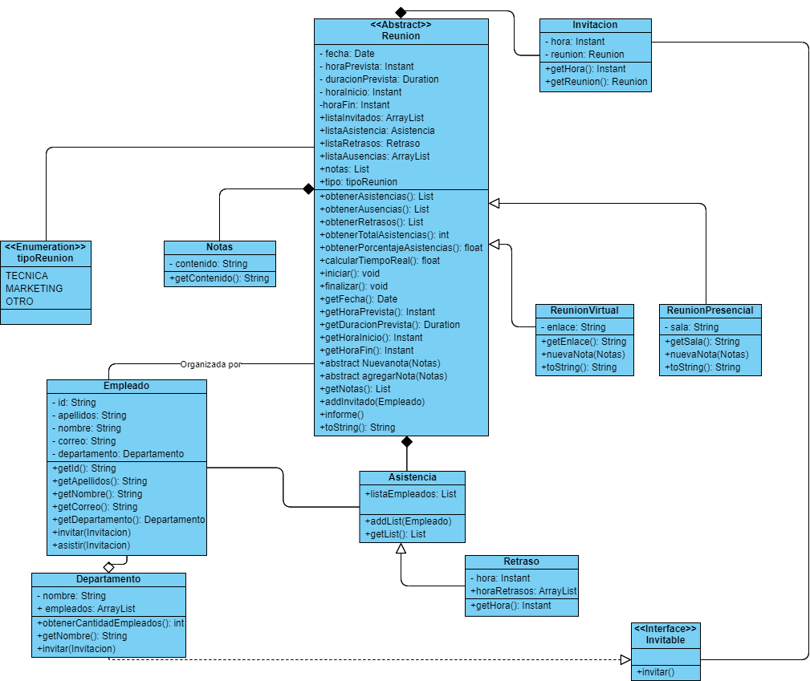

# Tarea-2-DOO
El código consiste en un sistema de gestión de reuniones que permita administrar tanto reuniones virtuales como presenciales.

Cada reunión está definida por una fecha, hora de inicio, duración prevista y una lista de invitados. Además, cada reunión pertenece a uno de los tres tipos principales: técnica, de marketing u otros.

Los empleados, que son nuestros invitados, están organizados en diferentes departamentos dentro de la empresa. Cada departamento tiene su propio nombre y número de empleados asociados.

## Autores
- Daniel Ignacio Aburto Rivera ([@daaburto](https://github.com/daaburto))
- Joaquín Hernán Sandoval Reyes ([@joaqsandoval04](https://github.com/joaqsandoval04))